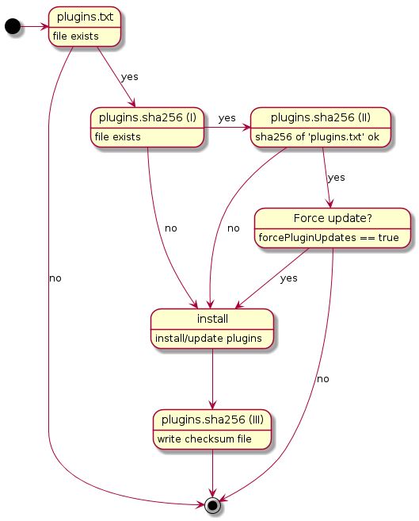

# Jenkins

The leading open source automation server

[https://jenkins.io/](https://jenkins.io/)

## TL;DR;

```console
$ helm install codecentric/jenkins
```

## Introduction

This chart install Jenkins on Kubernetes. 
It allows Jenkins to be completely configured as code that does not require any further manual configuration in the UI. While not required, it is meant to be used with the configuration-as-code plugin and/or Groovy init scripts.

## Prerequisites Details

Minimum required Kubernetes version is 1.9.

## Installing the Chart

To install the chart with the release name `jenkins`:

```console
$ helm install --name jenkins codecentric/jenkins
```

## Uninstalling the Chart

To uninstall/delete the `jenkins` deployment:

```console
$ helm delete jenkins
```

## Configuration

The following table lists the configurable parameters of the Jenkins chart and their default values.

Parameter | Description | Default
--- | --- | ---
`image.repository` | The Jenkins image repository | `jenkins/jenkins`
`image.tag` | The Jenkins image tag | `2.150.1`
`image.pullPolicy` | The Jenkins image pull policy | `IfNotPresent`
`imagePullSecrets` | Image pull secrets | `[]`
`podAnnotations` | Annotations for the Jenkins pod | `{}`
`javaOpts` | `JAVA_OPTS` for the Jenkins process | `-XX:+UnlockExperimentalVMOptions -XX:+UseCGroupMemoryLimitForHeap -XX:MaxRAMFraction=2 -XshowSettings:vm`
`extraEnv` | Allows the specification of additional environment variables for Jenkins. Passed through the `tpl` function and thus to be configured as string | `""`
`livenessProbe` | Liveness probe configuration | see `values.yaml` for defaults
`readinessProbe` | Readiness probe configuration | see `values.yaml` for defaults
`resources` | Resource requests and limits for the Jenkins pod | `{}`
`affinity` | Pod affinity | `{}`
`nodeSelector` | Node labels for pod assignment | `{}`
`tolerations` | Node taints to tolerate | `[]`
`terminationGracePeriodSeconds` | Optional duration in seconds the pod needs to terminate gracefully | `30`
`securityContext.runAsUser` | The UID to run the entrypoint of container processes | `1000`
`securityContext.fsGroup` | A special supplemental group that applies to all containers in a pod | `1000`
`securityContext.runAsNonRoot` | Indicates that the container must run as a non-root user | `true`
`serviceAccount.master.create` | Specifies whether to create a service account for the master pod | `false`
`serviceAccount.master.name` | The name of the service account for the master pod. If not set and `serviceAccount.master.create` is `true`, a name is generated using the fullname template with master as suffix | `""`
`rbac.master.create` | Specifies whether RBAC resources for the master pod are to be created | `false`
`rbac.master.rules` | Custom RBAC rules for the master pod. If not specified, the `cluster-admin` ClusterRole is used | `[]`
`serviceAccount.<agent>.create` | Specifies whether to create a service account for the <agent> pod | `false`
`serviceAccount.<agent>.name` | The name of the service account for the <agent> pod. If not set and `serviceAccount.<agent>.create` is `true`, a name is generated using the fullname template with <agent> as suffix | `""`
`rbac.<agent>.create` | Specifies whether RBAC resources for the <agent> pod are to be created | `false`
`rbac.<agent>.rules` | Custom RBAC rules for the <agent> pod. If not specified, the `cluster-admin` ClusterRole is used | `[]`
`service.master.type` | The service type for Jenkins master | `ClusterIP`
`service.master.clusterIP` | The clusterIP for the Jenkins master service | `""`
`service.master.externalIPs` | A list of external IP addresses for the Jenkins master service | `[]`
`service.master.loadBalancerIP` | The load balancer IP for the Jenkins master service if `service.master.type` is `LoadBalancer` | `""`
`service.master.loadBalancerSourceRanges` | A list of CIDRs allowed to access the load balancer | `[]`
`service.master.annotations` | Annotations for the Jenkins master service | `{}`
`service.master.port` | The port of the Jenkins master service | `8080`
`service.master.nodePort` | The NodePort of the Jenkins master service if `service.master.type` is `NodePort` | 
`service.agent.clusterIP` | The clusterIP for the Jenkins agent listener service | `""`
`service.agent.annotations` | Annotations for the Jenkins agent listener service | `{}`
`service.agent.port` | The port for the Jenkins agent listener service | `50000`
`persistence.enabled` | If `true`, persistent volume claims are created | `true`
`persistence.storageClass` | Persistent volume storage class | `""`
`persistence.size` | Persistent volume size | `10Gi`
`persistence.annotations` | Persistent volume annotations | `10Gi`
`persistence.existingClaim` | If set, an existing PVC with this name is used | `""`
`ingress.enabled` | If `true`, an ingress is created | `false`
`ingress.annotations` | Annotations for the ingress | `{}`
`ingress.paths` | A list of paths for the ingress | `[]`
`ingress.hosts` | A list of hosts for the ingress | `[]`
`ingress.tls` | A list of tls configurations for the ingress | `[]`
`casc.secrets` | Key/value pairs to be added to a secret that can be used by the configuration-as-code plugin | `{}`
`casc.existingSecret` | An existing secret containing casc secrets. If specified, `casc.secrets` is ignored | `{}`
`referenceContent` | Reference content to be copied to `JENKINS_HOME` before startup | `[]`
`forcePluginUpdates` | Specifies whether to update plugins at restart if `referenceContent` contains a `plugins.txt` file | `false`


Specify each parameter using the `--set key=value[,key=value]` argument to `helm install`.

Alternatively, a YAML file that specifies the values for the parameters can be provided while installing the chart. 
For example,

```bash
$ helm install --name keycloak -f values.yaml stable/keycloak
```

With the chart's default configuration, an initial admin user is automatically created and you will be guided through the installation wizard.
In most cases, this is probably not desired.
The goal should be to create a fully automated Jenkins installation that does not require any manual configuration steps.

While the chart disables the installation wizard by default, Jenkins ignores this when a default admin user is auto-created.
A more advanced configuration that explicitly creates a user and disables the setup wizard can be found in [ci/k8s-values.yaml](ci/k8s-values.yaml).

### JAVA_OPTS

By default, the following `JAVA_OPTS` are configured as environment variable:

```yaml
javaOpts: >-
  -XX:+UnlockExperimentalVMOptions
  -XX:+UseCGroupMemoryLimitForHeap
  -XX:MaxRAMFraction=2
  -XshowSettings:vm
```

This allows the JVM to be configured using memory settings for the container. 
By default, the JVM uses 50 % of the container's available memory.
Note that the JVM will also need off-heap memory.

Resource requests and limits should be configured.
If your Jenkins JVM should get 1 GiB of max. heap, the container should be set to 2 GiB.

```yaml
resources:
  requests:
    cpu: 2
    memory: 2Gi
  limits:
    cpu: 2
    memory: 2Gi
```

### Reference Content

Arbitrary files may be configured via ConfigMaps which are automatically copied to `JENKINS_HOME` by an init container before Jenkins starts up. This is mainly meant to be used for configuring plugins, the [configuration-as-code](https://github.com/jenkinsci/configuration-as-code-plugin) plugin, and Groovy init scripts.

*Example*
```yaml
referenceContent:
  - data:
      - fileName: foo.txt
        fileContent: |
          some foo content...
      - relativeDir: bar
        fileName: baz.txt
        fileContent: |
          some baz content...
```

The example above will create `/var/jenkins_home/foo.txt` and `/var/jenkins_home/bar/baz.txt`.

#### Plugins

Reference content may be used to configure plugins to be installed with the [mechanism](https://github.com/jenkinsci/docker/blob/master/README.md#preinstalling-plugins) that comes with the Jenkins Docker image.
If a file named `plugins.txt` is configured, the listed plugins are installed.
Installation happens in an init container in order to avoid dynamic loading issues.
Downloaded plugins are copied to `/usr/share/jenkins/ref/plugins/`.
The Jenkins start script contained in the Docker image automatically copies the plugins to `/var/jenkins_home/plugins` before Jenkins is started.

```yaml
referenceContent:
  - data:
      - fileName: plugins.txt
        fileContent: |
          configuration-as-code
          configuration-as-code-support
          workflow-aggregator
          kubernetes
          kubernetes-credentials-provider
          job-dsl
```

The file must list the plugins to be installed.
Versions are optional and must be delimited by a colon.
Since it may not be desirable that plugins are updated when the pod is restarted, the Helm chart implements the following logic:




It is advisable to use an LTS version of Jenkins.
LTS versions have their own update centers with compatible plugin versions only.
Don't specify versions in order to get the latest compatible versions.
In order to avoid unexpected plugin updates in case the pod is rescheduled, set `forcePluginsUpdates` to `false`, which is the default, and only set it to `true` temporarily in order to update plugins.

#### Configuration as Code

The chart supports the [configuration-as-code](https://github.com/jenkinsci/configuration-as-code-plugin) plugin. 
The plugin must be installed as specified above.
Additionally, a `jenkins.yaml` file must be configured.

```yaml
referenceContent:
  - data:
      - fileName: plugins.txt
        fileContent: |
          configuration-as-code
          configuration-as-code-support

      - fileName: jenkins.yaml
        fileContent: |
          # content goes here
```

Note that `fileContent` is rendered using the `tpl` function.
The content can, thus, be templated as shown in the following example:

```yaml
referenceContent:
  - data:
      - fileName: jenkins.yaml
        fileContent: |
          jenkins:
            numExecutors: 0
            remotingSecurity:
              enabled: true
            crumbIssuer:
              standard:
                excludeClientIPFromCrumb: false
            clouds:
              - kubernetes:
                name: kubernetes
                serverUrl: https://kubernetes.default
                namespace: {{ .Release.Namespace }}
                jenkinsUrl: http://{{ include "jenkins.fullname" . }}-master:{{ .Values.service.master.port }}
                jenkinsTunnel: {{ include "jenkins.fullname" . }}-agent:{{ .Values.service.agent.port }}
                templates:
                  - name: k8s-agent
                    idleMinutes: 30
                    namespace: {{ .Release.Namespace }}
                    nodeUsageMode: NORMAL
                    containers:
                      - name: jnlp
                        image: jenkinsci/jnlp-slave:3.27-1
                        ttyEnabled: true
          security:
            remotingCLI:
              enabled: false
```

The example above also shows how to configure Kubernetes agents using the Kubernetes plugin.
The parameters `jenkinsUrl` and `jenkinsTunnel` must be specified as shown above.
Jenkins master and agent listener have different services.
Thus, both parameters need to be specfied correctly.

Secrets should not be hard-coded in `jenkins.yaml`.
It is possible to provide secrets via Kubernetes secret.
The chart supports adding key/value pairs to a secret that can then be referenced in `jenkins.yaml`.

```yaml
casc:
  secrets:
    ADMIN_USER: admin
    ADMIN_PASSWORD: secret

referenceContent:
  - data:
      - fileName: jenkins.yaml
        fileContent: |
          jenkins:
            securityRealm:
              local:
                users:
                  - id: "${ADMIN_USER}"
                    password: "${ADMIN_PASSWORD}"
            authorizationStrategy:
              loggedInUsersCanDoAnything:
                allowAnonymousRead: false
```

Alternatively, an existing secret may be specified:

````yaml
casc:
  existingSecret: my-casc-secret
````

#### Groovy Init Scripts

The [configuration-as-code](https://github.com/jenkinsci/configuration-as-code-plugin) plugin should be the preferred way to configure Jenkins.
However, there are still compatibility issues with some plugins.
In this case, Groovy init scripts can be used which are executed after the [configuration-as-code](https://github.com/jenkinsci/configuration-as-code-plugin) plugin has done its job.

The following example configures the Locale plugin and disables usage statistics using a Groovy init script:

```yaml
referenceContent:
  - data:
      - fileName: plugins.txt
        fileContent: |
          configuration-as-code
          configuration-as-code-support
          locale

  - relativeDir: init.groovy.d
    data:
      - fileName: init.groovy
        fileContent: |
          import hudson.plugins.locale.PluginImpl
          import jenkins.model.Jenkins
          import net.sf.json.JSONObject

          println 'Running custom Groovy init script...'

          def jenkins = Jenkins.get()

          println 'Disabling localizatzion...'
          def localePlugin = jenkins.getPlugin(PluginImpl)
          JSONObject json = new JSONObject()
          json.put('systemLocale', 'en_US')
          json.put('ignoreAcceptLanguage', true)
          localePlugin.configure(null, json)
          localePlugin.save()

          println 'Disabling usage statistics...'
          jenkins.setNoUsageStatistics(true)

          println 'Saving changes...'
          jenkins.save()
```

### Credentials

The chart supports the [kubernetes-credentials-provider-plugin](https://jenkinsci.github.io/kubernetes-credentials-provider-plugin/).
A list of credentials may be configured which are stored as Kubernetes secrets.
The plugin automatially makes these secrets available as credentials in Jenkins.

```yaml
referenceContent:
  - data:
      - fileName: plugins.txt
        fileContent: |
          kubernetes-credentials-provider

k8sCredentials:
  - nameSuffix: test
    type: usernamePassword
    description: Some username
    data:
      username: foo
      password: secret
```

The plugin supports remapping fields using custom key bindings.
This can be achieved as follows:

```yaml
k8sCredentials:
  - nameSuffix: test
    type: usernamePassword
    description: Some username
    data:
      user: foo
      pass: secret
    keybindings:
      username: user
      password: pass
```

### RBAC

By default, no RBAC resources are created.
However, if your Jenkins Master or any of the agents need to access the Kubernetes API server, RBAC must be configured if your cluster has RBAC enabled.

The chart allows configuring ServiceAccounts and RBAC resources for the master as well as for any agents.
ServiceAcounts for agents can then be assigned in pod templates.
